# Consumo de Api

Aplicación de login desarrollada con **Angular 18**, proporciona una forma sencilla de iniciar sesión a través de un formulario, interactuando con una API externa para validar las credenciales de usuario.
Tras un inicio de sesión correcto, muestra una tabla con los datos de usuarios obtenidos también desde la API. 

## 🚀Características

- 📝 **Formulario de Login**: Permite a los usuarios ingresar sus credenciales (usuario y contraseña).
- 🔒 **Autenticación**: Se comunica con una API para validar las credenciales del usuario.
- 🎨 **Material Design**: La interfaz de usuario está elaborada con componentes de Material Design.

Después de un login exitoso, se podrá visualizar un menú en el cual el usuario podrá elegir entre dos opciones:

- 📊 **Tabla de Usuarios**: Una tabla con los datos de usuarios obtenidos de la API.
- 🌠 **Tabla APOD (Astronomy Picture of the Day)**: Una tabla donde se usa un API de la NASA para mostrar imágenes astronómicas diarias con sus descripciones.
En esta segunda tabla se implementa una columna con acciones; Ver, Editar y Eliminar, las ultimas dos acciones en la tabla están implementadas a nivel de interfaz de usuario. Estas acciones no realizan modificaciones en el servidor, ya que no se envían cambios a la API.  
- ⚠️ **Manejo de Errores**: Se visualizan mensajes de error si las credenciales son incorrectas o si ocurre algún problema con la API, para ello se hace uso de sweetAlert.

## 💻Requisitos

Antes de empezar, asegúrate de tener instalados los siguientes programas:

- **Node.js** (versión 14 o superior)
- **Angular 18**
- **Una API de autenticación** que también devuelva los datos de los usuarios.
Para esta actividad se hace uso de la API pública: https://api.escuelajs.co/api/v1/users

## 📦 Instalación

Sigue estos pasos para instalar y ejecutar el proyecto en tu máquina local:

### 1. Clona el repositorio en tu máquina local:

   git clone https://github.com/tu-usuario/tu-repositorio.git

### 2. Instala las dependencias:
Asegúrate de tener Node.js instalado, luego ejecuta el siguiente comando para instalar las dependencias del proyecto:
    npm install

### 3. Ejecuta el proyecto:
Una vez que todo esté configurado, inicia la aplicación con el siguiente comando:
    ng serve -o

Listo, podras visualizar el programa 

## 📌Resultados obtenidos

Login:

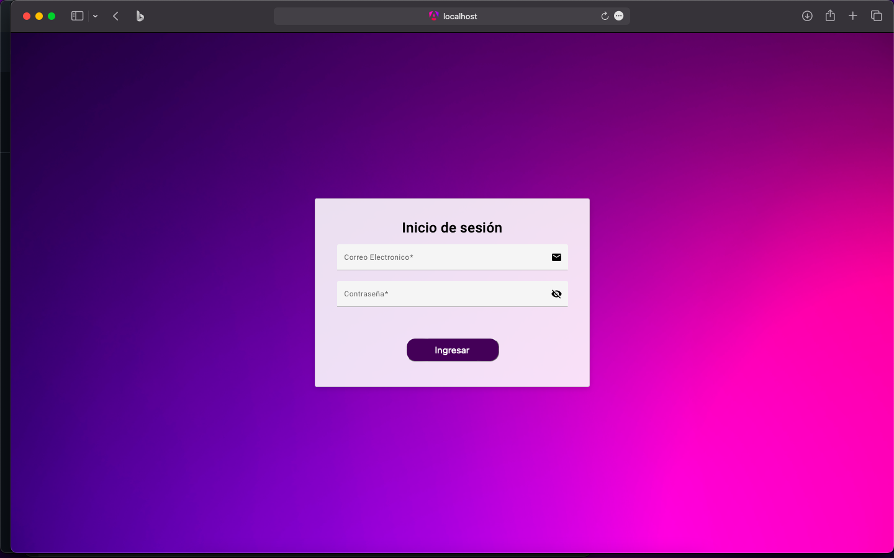

Mensaje de error:
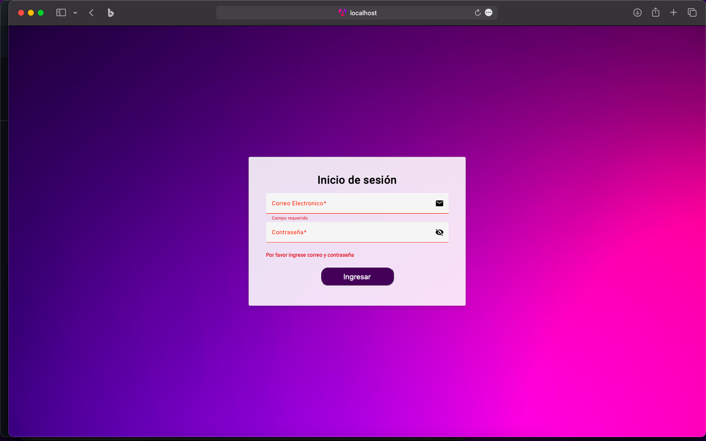
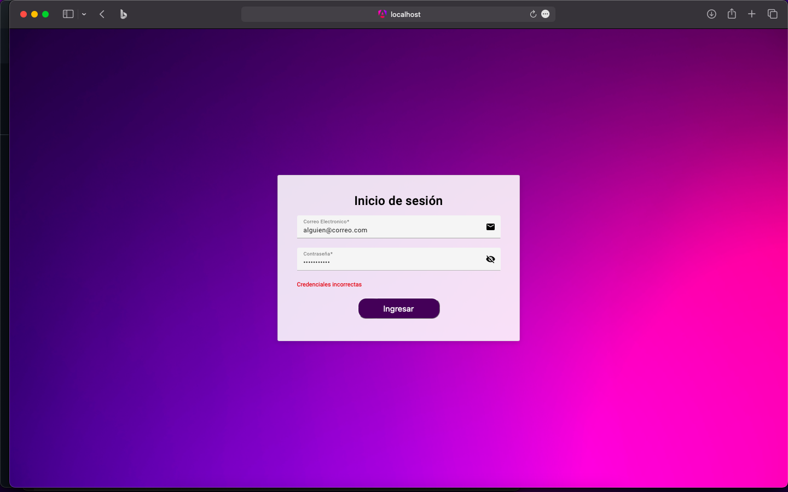

Consumo de apiUsuarios(Tabla):
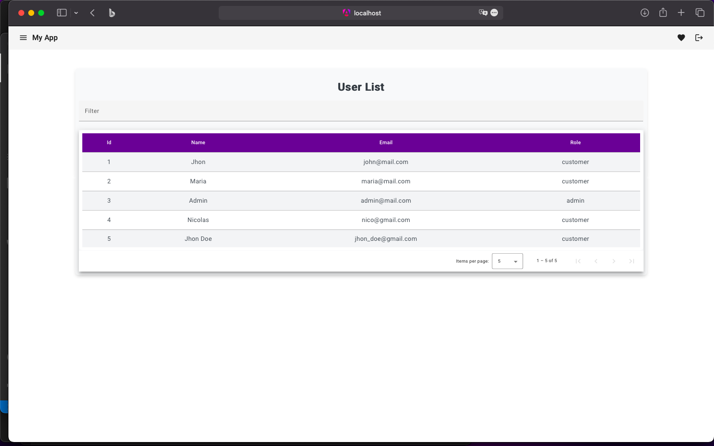

Consumo de apiAPOD(Tabla):
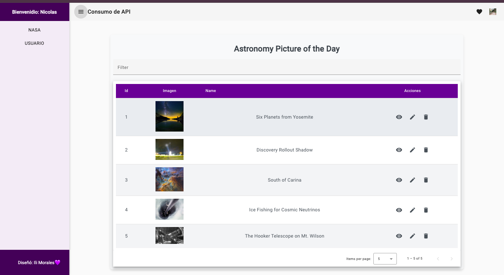

Acciones implementadas en la tabla APOD:

  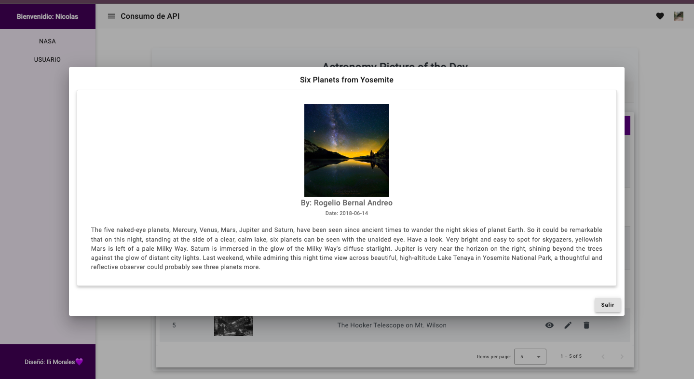
  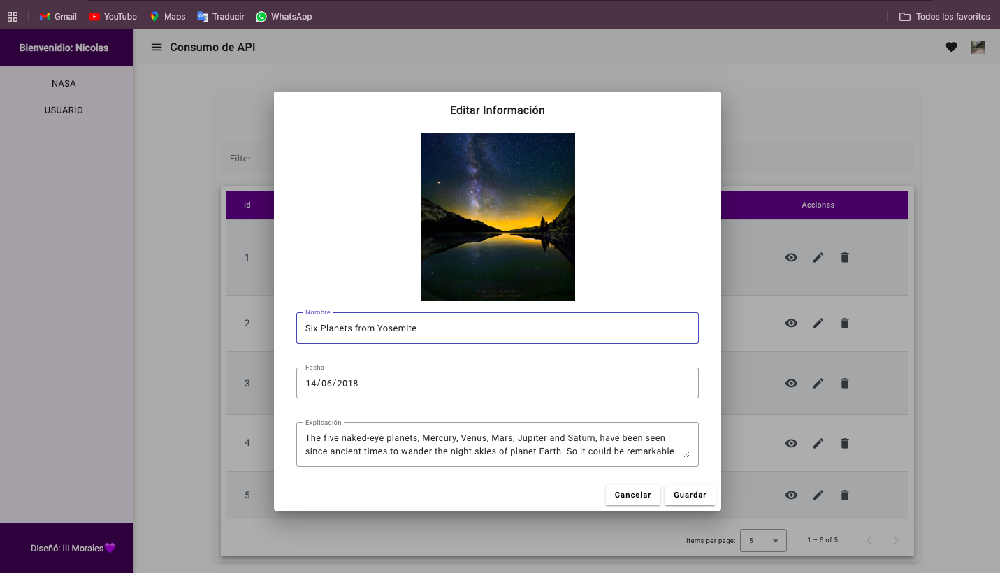
  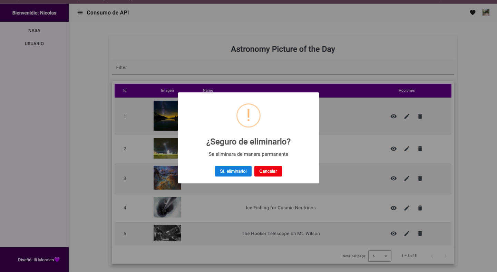

## 📚 Lo aprendido

### Consumir una API de usuarios y muestre los datos en una tabla usando componentes y servicios.
Pasos: 

- **Crear el Servicio para Consumir la API**
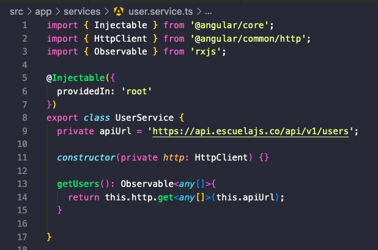

Pregunta: ¿Qué hace el método getUsers en este servicio?
Se realiza una solicitud HTTP GET a la URL definida en la propiedad apiUrl
El propósito de este método es obtener la lista de usuarios desde el servidor de la API. Cualquier componente o servicio que consuma UserService puede suscribirse al método getUsers para recibir y manejar esta lista de usuarios de manera reactiva.

- **Configurar HttpClientModule**
Agregar HttpClientModule para que Angular pueda hacer peticiones HTTP.
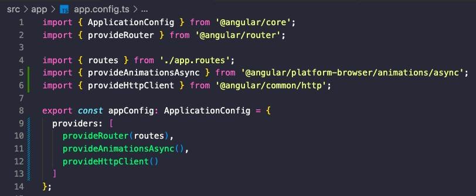

Pregunta:¿Por qué es necesario importar HttpClientModule?
A partir de Angular 15, se puede usar provideHttpClient(). Esto simplifica la configuración de la aplicación, especialmente cuando no se usan módulos tradicionales (@NgModule).
provideHttpClient() configura internamente el servicio HttpClient para realizar solicitudes HTTP(como GET, POST, PUT, DELETE, etc.).

- **Crear el Componente de la Tabla de Usuarios**
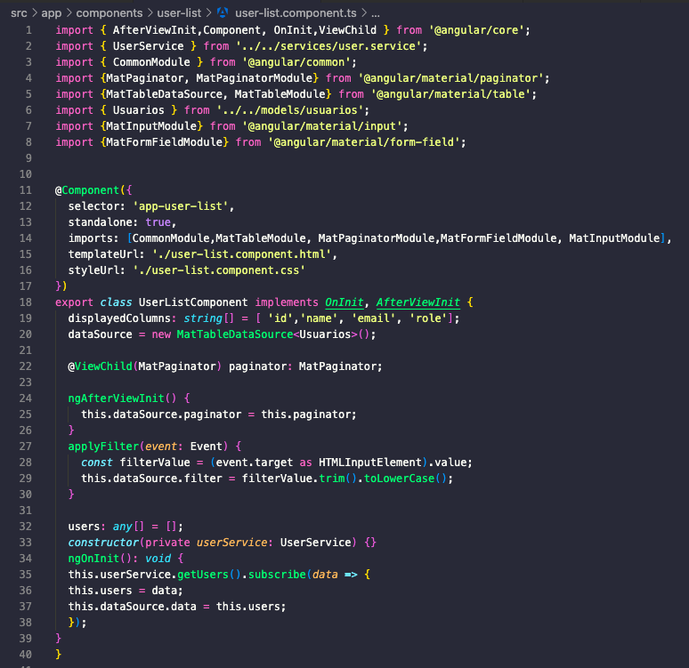

Pregunta: ¿Qué función cumple el método ngOnInit en el componente UserListComponent?
El método ngOnInit es parte del ciclo de vida de un componente en Angular. Se ejecuta una vez que Angular ha inicializado las propiedades del componente, pero antes de que el componente se renderice en la vista.
En este caso, dentro de ngOnInit, se hace lo siguiente:
Obtener los usuarios: Se llama al método getUsers del servicio UserService, que realiza una solicitud HTTP para obtener los datos de los usuarios desde una API.
Suscripción a la respuesta: El método getUsers devuelve un Observable, por lo que se utiliza .subscribe() para recibir los datos de la API de manera asíncrona.
Asignación de datos: Una vez que los datos son recibidos, se asignan al array users del componente y también se actualiza la fuente de datos de la tabla (dataSource.data).
Esto permite que cuando el componente se inicializa, se carguen los datos de los usuarios y se muestren en la vista.

- **Crear el Componente de la Tabla de Usuarios**
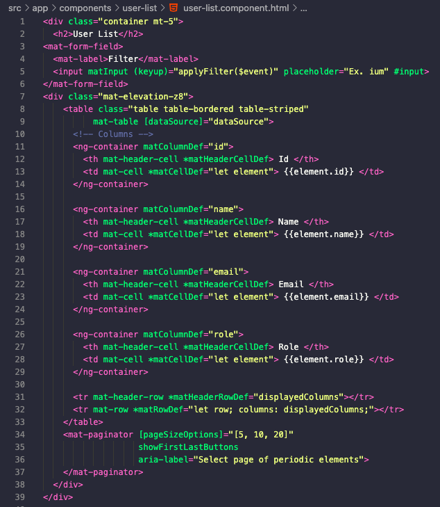

Pregunta: ¿Para qué sirve el bucle *ngFor en Angular? 
El bucle *ngFor en Angular es una directiva estructural que se utiliza para iterar sobre una lista (un array u objeto iterable) y renderizar una sección de HTML para cada elemento en la lista. En otras palabras, crea una copia de un bloque HTML para cada item del array o iterable que se pase como parámetro, posteriormente sse sutiye por otros metodos debido a la paginacion agregada al componente.

## PREGUNTAS FINALES
1. Ventajas de usar servicios en Angular para el consumo de APIs
El uso de servicios en Angular para consumir APIs permite mantener el código más organizado . Al separar la lógica de las solicitudes HTTP de los componentes, se mejora la mantenibilidad y se facilita la reutilización del código. Los servicios centralizan el manejo de errores, lo que garantiza una gestión coherente de los fallos en las solicitudes.

2. Importancia de separar la lógica de negocio de la lógica de presentación
Resulta importante ya que permite realizar cambios en la interfaz de usuario sin afectar el comportamiento interno de la aplicación y viceversa. También facilita la reutilización de la lógica de negocio en diferentes partes de la aplicación. 

3. Otros tipos de datos o APIs que podrías integrar
Dependiendo de las necesidades del proyecto se pueden integrar diferentes tipos de APIs. Algunas opciones:
APIs RESTful o GraphQL para consumir datos (usuarios, productos, etc.).
Servicios de mapas como Google Maps o Mapbox.
APIs de inteligencia artificial como Google Cloud Vision o OpenAI.
Servicios de correo electrónico como SendGrid para enviar notificaciones.

**✒️Ilian Morales** - [iliMorales 💜](https://github.com/Ilimm9)